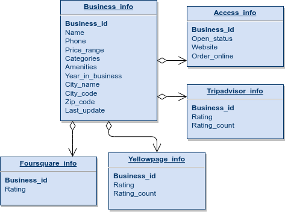

# YellowScraper-v1
- This project is part of my studies of Data Engineering, This is a python scraper that retrieves restaurant listings data from yellowpages.com and stores it in a postgres database
The scraper fetches data based on a list of city(s) and the number of page(s) requested for each city, it can also discover nearby cities by scraping the nearby cities section.

## Prerequisites
- Python 3.x
- Conda
- Postgresql server

## To run this project
1) Clone the repo `git clone https://github.com/yacine717/YellowScraper`
2) Create conda environment `conda env create --name my_project --file environment.yml`
3) Activate conda environment `conda activate my_project` 
4) Run to create database and database tables `python3 init_sql.py`
5) Run the script `python3 scraper.py`

## Database model
The data then stored in a normalized form to avoid data redundancy in the following tables:
- Business_info:
  - Business_id, Bigserial, PrimaryKey
  - Name, Varchar
  - Phone, Varchar
  - Price_range, Int
  - Categories, Array of Text
  - Amenities, Array of Text
  - Year_in_business, Int
  - City_code, Varchar
  - City_name, Varchar
  - Zip_code, Varchar
  - Last_update, datetime
- Foursquare_info:
  - Business_id, bigint, ForiegnKey
  - Rating, Float
- Access_info:
  - Business_id, bigint, ForiegnKey
  - Open_status, Varchar
  - Website, Varchar
  - Order_online Varchar
- Tripadvisor_info:
  - Business_id, bigint, ForiegnKey
  - Rating, Float
  - Rating_count, Int
- Yellowpage_info:
  - Business_id, bigint, ForiegnKey
  - Rating, Float
  - Rating_count, Int

## TODO
  - add sample csv data
  - add visualizations
  - use SQLalchemy

## Future Goals
  - planning to create a second version of this project on airflow
  - automate airflow and postgres deployment using Ansible

## Notes
- The csv processing part of this project is still in progress 
- If you encounter any issues while running the project, please create a new issue in the repository.

## Acknowledgments
Special thanks to my fellow engineers at the dataGarage discord community who helped in the making of this project.
